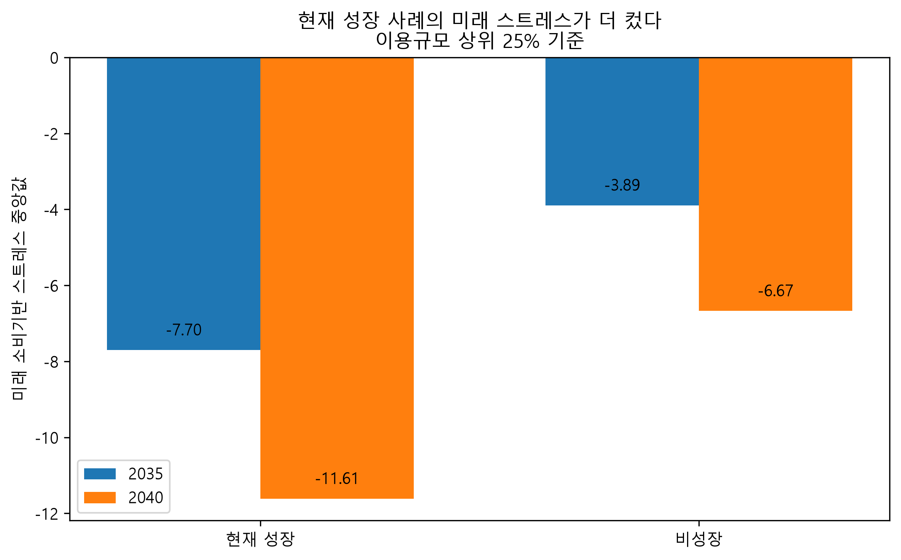
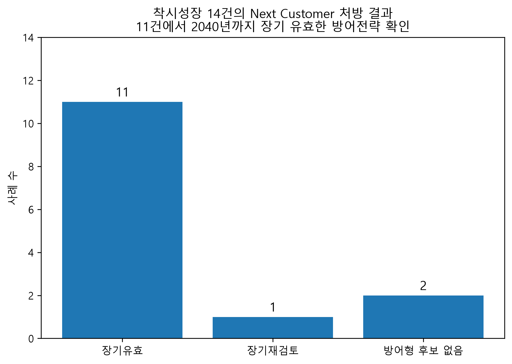

# 미래 소비기반 스트레스 테스트

현재 매출이 성장하는 상권도 핵심 소비연령의 인구가 감소하면 미래 소비기반이 약해질 수 있습니다. 이 프로젝트는 BC Card 결제 데이터와 장래인구, NAVER 관심도 자료를 결합해 지역과 업종별 미래 구조위험을 진단하고 유형별 고객 및 상품 전략을 제안합니다.

## 분석 질문

- 현재 성장 중인 상권의 소비기반은 2040년에도 유지되는가?
- 결제 고객과 관심 고객, 미래 고객은 어떻게 다른가?
- 생활인구 또는 유동인구를 반영해도 기존 진단과 위험순위가 유지되는가?

## 분석 흐름

1. BC Card 2026년 1월부터 6월까지의 결제 데이터를 지역, 업종, 연령 단위로 집계합니다.
2. 6개월 완전 사례와 지역별 이용금액 상위 25%를 선정합니다.
3. 월평균증감률, 1월 대비 6월 변화, 상승개월수로 현재 성장을 판정합니다.
4. 연령별 이용금액 비중과 2040년 인구증감률을 결합해 Future Stress를 계산합니다.
5. 현재 성장 여부와 Future Stress 부호를 결합해 네 가지 상권 유형을 분류합니다.
6. NAVER Search와 Shopping Insight로 관심 고객과 상품 후보를 해석합니다.
7. 지역별 외부유입 자료로 분류 일치율과 Spearman 순위 상관을 확인합니다.

## 핵심 공식

```text
Future Stress = Σ(연령별 이용금액 비중 × 2040년 인구증감률)
```

Future Stress가 음수이면 현재 소비구조가 미래 인구감소에 더 많이 노출된 것으로 해석합니다. 이 지표는 미래 매출액 예측값이 아니라 소비기반의 상대적 구조위험을 진단하는 지표입니다.

## 네 가지 진단 유형

| 현재 성장 | Future Stress | 유형 | 전략 방향 |
|---|---:|---|---|
| 성장 | 취약 | 착시성장형 | 방어 |
| 성장 | 안정 | 지속성장형 | 확장 |
| 비성장 | 취약 | 구조취약형 | 재편 |
| 비성장 | 안정 | 회복기회형 | 선점 |

## 검증 방법

- Mann-Whitney U 검정으로 성장군과 비성장군의 Stress 분포 차이를 확인했습니다.
- Spearman 상관계수로 외부유입 보정 전후의 위험순위가 유지되는지 확인했습니다.
- 위험과 안정의 부호가 같은 사례 비율을 분류 일치율로 계산했습니다.

서울, 부산, 경기는 외부유입 데이터의 기간과 구조, 보정 방식이 다릅니다. 각 지역 안에서 원본과 보정 결과를 비교했으며 지역 간 수치를 직접 비교하지 않습니다.

## 결과 예시





## 기술 스택

- Python, Jupyter Notebook
- pandas, NumPy
- SciPy
- requests
- Matplotlib

## 저장소 구성

```text
notebooks/    실행 출력과 인증정보를 제거한 분석 노트북
assets/       포트폴리오용 결과 이미지
docs/         최종 발표자료와 모델링 흐름도
data/         데이터 비공개 사유와 재현 안내
scripts/      공개용 노트북 정리 스크립트
```

## 데이터 공개 범위

공모전에서 제공한 BC Card 원본 및 파생 데이터는 저장소에 포함하지 않습니다. 서울, 부산, 경기의 외부 데이터도 원본 파일 대신 출처와 처리 방식을 문서화합니다. 노트북 실행에는 사용 권한이 있는 원본 데이터와 NAVER API 인증정보가 필요합니다.

## 발표자료

- [최종 발표자료](docs/bc_card_future_consumer_stress.pptx)
- [데이터 모델링 흐름도](docs/modeling_pipeline_slide.pptx)

